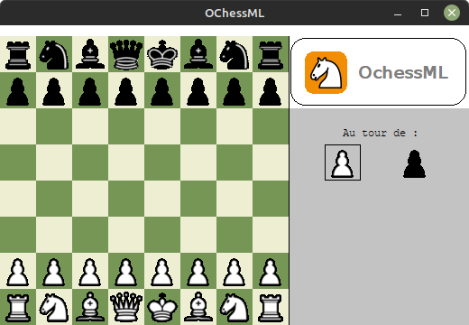

# OChessML


*For archive purpose only, the project is no longer maintained*

---

## Presentation

Chess game coded with OCaml for a course project.

---

## Play



### Windows

Download the executable [OChessML.exe](./build/OChessML.exe).

Launch the executable to start the game.

### Linux

Download the executable [OChessML](./build/OChessML).

Launch the executable to start the game.

---

## File structure

```bash
.
├── build           # Executables
├── src
│   ├── assets
|   |   └── ...
│   ├── pieces
|   |   └── ...
│   ├── action.ml   # Handle actions
│   ├── logo.ml     # Display logo
│   ├── menu.ml     # UI
│   ├── ochess.ml   # Main file
└── OChess.ml       # One file that contain all the code for building purpose
```

---

## Build

### Linux

```bash
# Install OPAM
sudo apt install opam
```

### Windows

Install OCaml and OPAM with [Cygwin](https://fdopen.github.io/opam-repository-mingw/cygwin/)

### Install required packages

```bash
# Initialize OPAM and install packages
opam init
opam install graphics ocamlfind
eval $(opam env)
```

### Build executable

**Linux**
```bash
ocamlfind ocamlopt -package graphics -linkpkg OChess.ml -o OChessML
```

**Windows**
```bash
ocamlfind ocamlopt -package graphics -linkpkg OChess.ml -o OChessML.exe
```